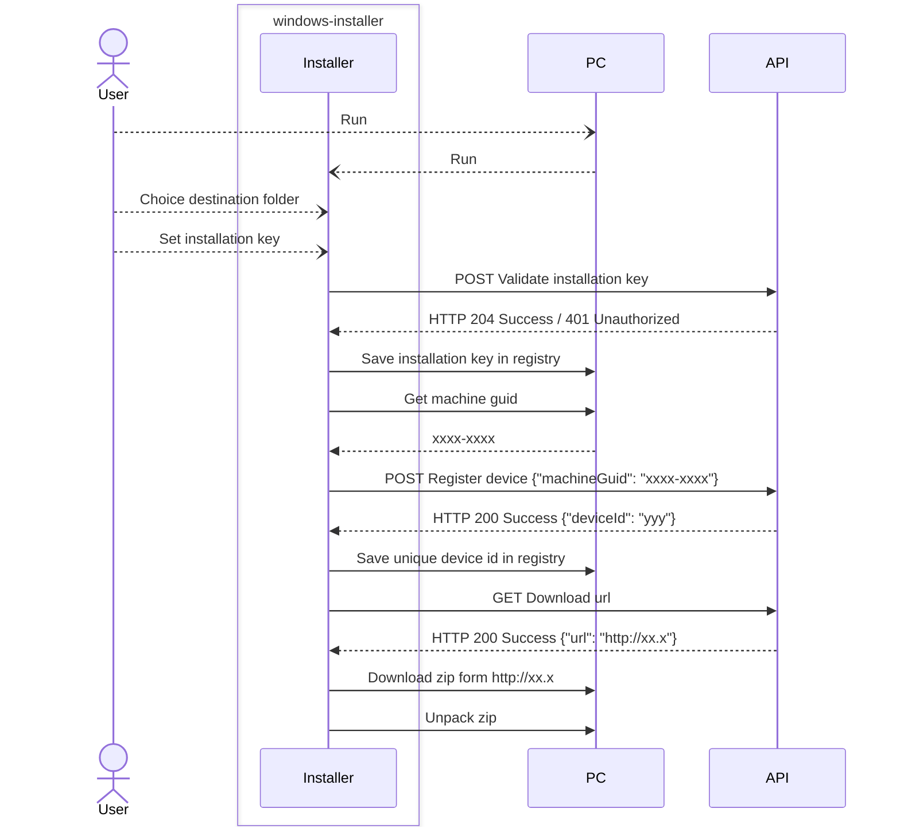

# windows-installer

NSIS Unicode (NSISw) installer implementing license-based provisioning.
The installer collects a device identifier, validates the license key against a remote API,
receives a device-specific download URL, downloads a ZIP payload, 
and extracts binary artifacts during installation. Installer configuration, texts, 
and branding are centralized in app.nsh for easy customization.

## Requirements

* Windows
* NSIS (Unicode / NSISw)
* Administrator privileges (required for installation and device identification)
* Network access (HTTPS) to the licensing API
* ZIP payload accessible via API-provided URL

## Installation Flow
1. Installer is launched by the user.
2. User enters a license key.
3. Installer collects a device identifier (e.g. Windows MachineGuid or generated UUID).
4. License key and device identifier are sent to the remote API.
5. API validates the license and assigns a device ID.
6. API returns a device-specific download URL.
7. Installer downloads the ZIP payload from the provided URL.
8. ZIP archive is extracted and binaries are installed.
9. Installation completes.

## Security Notes
* The installer store registered device identifier.
* All API communication must use HTTPS.
* License validation and device assignment logic is enforced server-side.
* The API-provided download URL should be short-lived and device-bound.
* The installer assumes a zero-trust client model; all critical validation happens on the backend.
* Configuration and branding are isolated in app.nsh to avoid logic modification.

# Icons
Icons (installer.ico and uninstaller.ico) created by McDo Design (Susumu Yoshida) 
